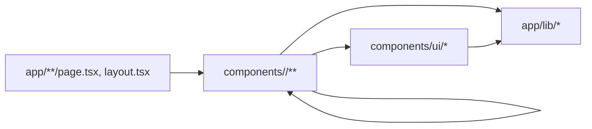

# DevStash project structure

This document defines where files live and how they may import each other.
Follow it for every new page, component, and helper. `AGENTS.md` remains the
authority on security; this document only covers organization and must never be
used to justify weakening a security boundary.

## Principles

1. **One page, one feature folder.** Everything a page is made of lives in one
   folder under `app/components/<feature>/`, organized by role. `page.tsx` only
   composes those pieces and holds page-level state.
2. **Shared means shared.** `app/components/ui/` holds reusable, page-agnostic
   primitives only. Nothing there knows about a specific page, its copy, or its
   data.
3. **Promote late.** A component moves into `ui/` only when a second feature
   actually needs it, not because it might be reused someday.
4. **Imports flow one way.** Features depend on `ui/`. `ui/` depends on nothing
   in a feature. Features do not import from each other.

## Directory layout

```
app/
  layout.tsx                   # root shell: fonts, metadata, <html>/<body>
  layout.types.ts              # root layout props
  page.tsx                     # "/" landing page: composition only
  globals.css                  # design tokens and global styles
  favicon.ico
  (app)/                       # route group: authenticated shell, not in URL
    layout.tsx                 # wraps every private page in <AppShell>
    dashboard/page.tsx
    vault/page.tsx
    projects/page.tsx
    projects/[id]/page.tsx
    notes/page.tsx
    tasks/page.tsx
    generator/page.tsx
    settings/page.tsx
  lib/                         # shared non-UI modules (types, session, helpers)
    vault-data.types.ts        # in-memory shapes of decrypted content
    vault-types.ts             # per-type labels and colors
    vault-session.tsx          # locked/unlocked client context (preview)
    vault-session.types.ts
    mock-vault-data.ts         # synthetic fixtures for the UI preview only
    password-generator.ts      # secure-random generation, no UI
    format.ts                  # deterministic formatters
  components/
    ui/                        # shared, reusable primitives (incl. shadcn/ui)
      icons.tsx
      icons.types.ts           # shared IconProps for the icons
      modal.tsx
      modal.types.ts           # modal props and width type
      starfield-canvas.tsx     # promoted: used by landing and shell
      console-panel.tsx        # terminal-style card frame
      page-heading.tsx
      type-badge.tsx
      masked-value.tsx         # mask / timed reveal / explicit copy
      empty-state.tsx
    landing/                   # left half of "/": hero, chrome, modals, background
      sections/                # visible regions in reading order
        landing-header.tsx
        landing-hero-panel.tsx
        feature-pillars.tsx
        landing-footer.tsx
      modals/                  # overlays opened from the landing page
        security-modal.tsx
        envelope-modal.tsx
        envelope-diagram.tsx
      background/              # decorative, non-interactive layers
        orbital-horizon.tsx
    auth/                      # right half of "/": Google sign-in panel
      auth-terminal-panel.tsx
    shell/                     # authenticated frame shared by all (app) pages
      app-shell.tsx            # provider + locked/unlocked gate
      nav-items.ts
      sections/                # header, sidebar, status bar
      lock/                    # unlock / first-time setup panel
      palette/                 # Ctrl+K command palette (local search)
    dashboard/sections/        # overview panels
    vault/                     # secrets list, type filter, detail
    projects/                  # project cards, detail, .env viewer
    notes/                     # notes browser
    tasks/                     # task list
    generator/                 # password generator UI
    settings/                  # preference panels
docs/
  PROJECT_STRUCTURE.md         # this file
public/                        # static assets served at "/"
```

Components with declared props or supporting types have an adjacent
`<component-name>.types.ts` file; feature type files are omitted from the tree
above for brevity.

Later routes follow the same pattern. Each gets a route file in `app/` (or
`app/(app)/` when it belongs behind the shell) and one feature folder in
`app/components/`, created only when that page is built:

```
app/login/page.tsx           -> app/components/auth/        (reused)
app/api/.../route.ts         -> ciphertext-only Route Handlers, no UI
```

### `app/lib/`

- Shared modules with no JSX except React context providers.
- May be imported from `ui/`, any feature, and route files via
  `@/app/lib/<file>`.
- Must not import from `components/`.
- `mock-vault-data.ts` exists only for the UI preview and is removed when
  client-side decryption of real ciphertext lands.

## Folder rules

### `app/components/ui/`

- Reusable building blocks: icons, modal shell, buttons, inputs, and any
  component generated by shadcn/ui.
- No page-specific text, data constants, or business logic.
- Imported with the alias from anywhere: `@/app/components/ui/<file>`.
- Must not import from any feature folder. May import types and helpers from
  `app/lib/`.

### `app/components/<feature>/`

- One folder per page or per self-contained half of a page (`landing`, `auth`).
- Group files by role inside the feature. Current roles:
  - `sections/`: visible regions of the page (header, hero, panels, footer).
  - `modals/`: overlays and their internal parts.
  - `background/`: decorative canvases and visual layers.
  - Add `forms/`, `tables/`, `lists/` and similar when a feature needs them.
  - A feature with only one or two files (like `auth/` today) stays flat until
    it grows.
- Imported by `page.tsx` with relative paths:
  `./components/landing/sections/landing-header`.
- Siblings inside a feature import each other relatively:
  `./envelope-diagram`, `../modals/security-modal`.
- Never imported by another feature or by `ui/`.

### Props and supporting types

- Export component props and supporting types from an adjacent
  `<component-name>.types.ts` file, and import them with `import type`.
- Keep types for one component together. Do not create empty type files for
  components with no declared types, a global type collection, or barrel exports.
- Type files contain only type declarations and type-only imports, including
  React types such as `ReactNode`; no runtime logic or component imports.
- Reuse a type when it describes the same contract, such as `IconProps` across
  the icons. Keep feature-specific types inside their owning feature and follow
  the same import direction as components.

### Static copy and data

Constants such as `INVARIANTS`, `CAPABILITIES`, and `ACCESS_STEPS` stay at the
top of the component that renders them. Move copy into a `content.ts` file in
the same feature folder only when two components in that feature share it.

## Naming

- Components: `kebab-case.tsx`. The filename matches the primary export
  (`feature-pillars.tsx` exports `FeaturePillars`). Type files use the matching
  `kebab-case.types.ts` name.
- Components: `PascalCase` named exports. Default exports are reserved for
  Next.js special files (`page.tsx`, `layout.tsx`, `route.ts`).
- Props interfaces: `<ComponentName>Props`, exported from the adjacent type
  file. Shared icon components use `IconProps`.
- Feature folders and role folders: lowercase, singular for features
  (`landing`, `auth`), plural for roles (`sections`, `modals`).

## Import direction



Allowed:

- route files -> any feature folder they compose, `ui/`, `lib/`
- feature folders -> `@/app/components/ui/*` and `@/app/lib/*`
- `ui/` -> `@/app/lib/*`
- files within one feature -> each other

Not allowed:

- `ui/` -> anything under a feature folder
- `lib/` -> anything under `components/`
- one feature -> another feature (`vault/` must not import from `shell/`)

## Adding a new page

1. Create `app/<route>/page.tsx`, or `app/(app)/<route>/page.tsx` for a page
   that belongs behind the authenticated shell. Keep it to composition and
   top-level state; no large JSX blocks. Pages under `(app)` only mount while
   the vault is unlocked, so they may call `useUnlockedVault()`.
2. Create `app/components/<feature>/` with only the role folders the page
   needs.
3. Put every page-only element in that feature folder; import relatively.
4. Use `@/app/components/ui/*` for shared primitives. If a primitive you need
   does not exist, build it inside the feature first; promote it to `ui/` when
   a second feature needs it.
5. Add `"use client"` only where the component holds state, effects, or
   browser APIs.
6. Run `npm run lint` and `npm run build` before asking for review.

## Security boundary reminder

Structure does not change the client/server rules in `AGENTS.md`:

- Anything that handles the Vault Passphrase, keys, or decrypted data is a
  Client Component inside its feature folder, never in a Server Component and
  never in `ui/` as a data-holding primitive.
- Route Handlers under `app/api/` accept and return ciphertext only.
- Do not place secrets, plaintext previews, or private identifiers in
  filenames, route segments, or `public/`.
