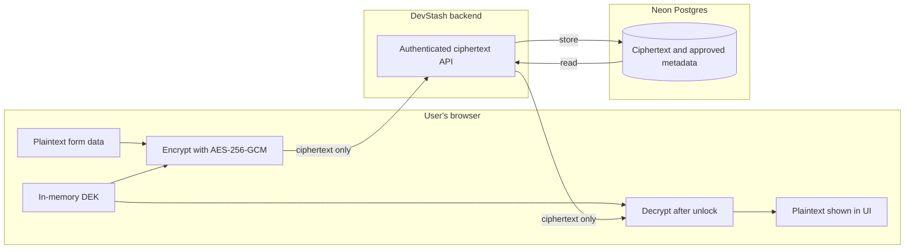
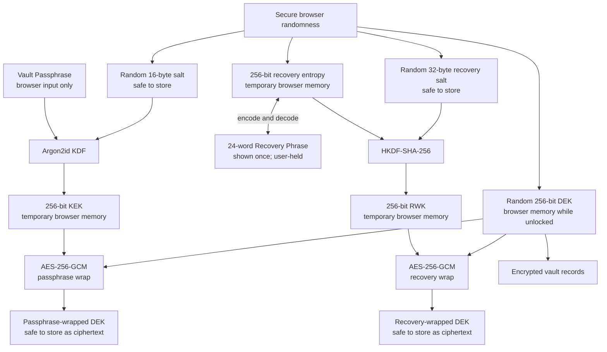
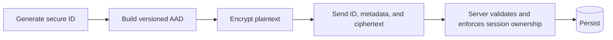

# DevStash vault encryption architecture

Status: Phase 1 architecture record approved for the later cryptographic proof.
The recovery design is documented but not yet implemented or independently
audited.

Last reviewed: 2026-09-10.

This document explains how DevStash should create, unlock, recover, lock, and
update a user's encrypted vault. It is written as the contract for the later
cryptographic proof, persistence, API, and user-interface phases.

`AGENTS.md` remains authoritative. If this document conflicts with a project
security invariant, the invariant wins and this design must be revised before
implementation.

Phase 1 changes documentation only. It does not authorize adding a
cryptographic dependency, changing the production CSP, creating vault tables or
Route Handlers, applying a Prisma migration, or enabling passphrase input. Those
changes remain gated by the later proof, schema, API, and lifecycle phases.

## Phase 1 decision

The approved V1 architecture uses two independent ways to unwrap one vault DEK:

- The Vault Passphrase is the normal unlock credential.
- A mandatory browser-generated 24-word Recovery Phrase is the only
  lost-passphrase recovery credential.
- Google authentication is required for either flow but cannot decrypt or
  recover the vault by itself.
- DevStash never receives or stores either credential or their plaintext key
  material.
- Losing both credentials leaves the vault permanently unrecoverable through
  DevStash.

Approval means these boundaries may proceed to Phase 4 proof and testing. It is
not evidence that the proposed dependencies, parameters, browser behavior, CSP,
or cryptographic implementation have passed those later gates.

## Essential boundary

Google authentication and vault unlocking are separate operations:

- Google verifies the user's identity and creates an authenticated session.
- The Vault Passphrase derives encryption key material inside the browser.
- The Recovery Phrase reconstructs independent recovery key material inside the
  browser when the passphrase is unavailable.
- The backend authenticates, authorizes, validates, and stores ciphertext.
- The backend never decrypts and re-encrypts vault content.

The normal data flow is:



Plaintext private content, the passphrase, the Recovery Phrase, the Key
Encryption Key (KEK), the Recovery Wrapping Key (RWK), and the unwrapped Data
Encryption Key (DEK) must never cross the browser/server boundary.

## Goals and non-goals

### V1 goals

- Keep vault plaintext in the browser during normal operation.
- Reduce the harm of a database or snapshot disclosure.
- Detect ciphertext, authentication-tag, nonce, AAD, owner, ID, type, and
  version tampering.
- Keep Google identity separate from vault encryption.
- Allow a passphrase change without re-encrypting every record.
- Allow a user who still has the Recovery Phrase and an authenticated Google
  session to replace a lost passphrase without re-encrypting every record.
- Make loss of both the passphrase and Recovery Phrase explicitly and
  irreversibly unrecoverable through DevStash.
- Fail closed when data is invalid, corrupted, or unsupported.

### V1 non-goals

- No server-side passphrase reset or decryption bypass.
- No server-generated or server-readable Recovery Phrase, escrow, recovery
  question, trusted-device unlock, or shared vault.
- No recovery from a lost passphrase unless the user retained the Recovery
  Phrase; Google authentication alone is never sufficient.
- No server-side plaintext search or plaintext metadata mirrors.
- No protection from a compromised browser, device, extension, deployed
  JavaScript bundle, or XSS while the vault is unlocked.
- No claim that DevStash is zero-knowledge, audited, unbreakable, compliant, or
  safe for important real credentials.

## Threat model

The design assumes HTTPS is configured correctly and the browser receives the
intended DevStash application. It distinguishes passive storage compromise from
an active compromise of the code that handles plaintext.

| Threat or failure | V1 response | Residual limitation |
| --- | --- | --- |
| Read-only Neon database or backup disclosure | Attacker receives ciphertext, both wrapped-DEK values, salts, KDF settings, and approved metadata but no plaintext key | The passphrase-wrapped DEK enables offline passphrase guesses; Argon2id raises their cost but cannot rescue a weak passphrase. The recovery-wrapped DEK is protected by 256 bits of browser-generated entropy rather than a user-chosen phrase |
| Ciphertext, nonce, tag, AAD, owner, ID, type, or relationship tampering | AES-GCM authentication fails before any plaintext is returned | Availability can still be attacked by deleting or withholding data |
| Unauthenticated request or another signed-in user | Every endpoint authenticates, derives the owner from the server session, and scopes access near the data layer | A server authorization defect remains possible and requires IDOR tests |
| Passive network observer | HTTPS protects requests and responses in transit; application payloads remain ciphertext outside the browser | TLS termination and hosting infrastructure still observe approved metadata and traffic patterns |
| Stale client attempting a passphrase or Recovery Phrase update | Profile revision compare-and-swap rejects the stale write | A privileged database operator can roll back an entire database snapshot; V1 has no external monotonic state to detect that rollback |
| Malicious server, compromised deployment, dependency, or build pipeline | Outside the protection claim | Altered JavaScript can capture a passphrase, Recovery Phrase, KEK, RWK, DEK, or plaintext during setup, recovery, or unlock |
| XSS, malicious extension, keylogger, screen or clipboard monitor, or compromised device | Outside the protection claim during setup, recovery, or while unlocked | CSP, dependency review, masking, and timed reveal reduce exposure but cannot make a compromised browser trustworthy |
| Lost passphrase while the Recovery Phrase is available | After Google authentication, the browser may unwrap the DEK with the Recovery Phrase and require a new passphrase | Anyone with the Recovery Phrase plus access to the authenticated account or a database copy can attempt to recover the vault |
| Lost passphrase and lost Recovery Phrase | No bypass; fail closed | The encrypted vault is permanently unrecoverable through DevStash |
| Recovery Phrase is disclosed | Rotate the current recovery wrapper after unlocking with the passphrase and treat the vault as potentially compromised | Because V1 reuses the same DEK, an attacker with the old phrase and an older profile or backup containing its matching wrapper can still recover that DEK; full DEK rotation and record re-encryption require a separately reviewed design |
| Deleted ciphertext or unavailable service | No bypass; fail closed | V1 provides confidentiality and limited credential recovery, not guaranteed data availability |

Approved plaintext metadata and access timing can reveal that a user has records,
their types, relationships, sizes, and update patterns. The product must not
describe these values as secret merely because record contents are encrypted.

## Key hierarchy

Neither the passphrase nor Recovery Phrase encrypts every vault record directly.
The passphrase derives a KEK. The Recovery Phrase decodes to a separate random
secret from which an RWK is derived. Each wrapping key independently protects
the same random DEK, and that DEK encrypts the records.



Changing the passphrase derives a new KEK and rewraps the same DEK. Existing
records and the recovery-wrapped DEK remain unchanged. Rotating the Recovery
Phrase similarly derives a new RWK and replaces only the recovery-wrapped DEK.

## Cryptographic material inventory

| Data | Neon/server | Persistent browser storage | Browser memory |
| --- | --- | --- | --- |
| Vault Passphrase | Never | Never | Only during derivation |
| Recovery Phrase and decoded recovery entropy | Never | Never | Only during setup, recovery, or rotation |
| Argon2id salt and parameters | Yes | No private cache | While needed |
| HKDF salt, algorithm, and recovery-phrase encoding identifier | Yes | No private cache | While needed |
| Plaintext KEK | Never | Never | Only during wrap or unwrap |
| Plaintext RWK | Never | Never | Only during recovery wrap or unwrap |
| Plaintext DEK bytes | Never | Never | Only during import or rewrap |
| Non-extractable DEK key handle | Never | Never | While unlocked |
| Passphrase-wrapped and recovery-wrapped DEK | Yes | No private cache | While needed |
| Record nonces and ciphertext | Yes | No private cache | While needed |
| Decrypted records and search results | Never | Never | While unlocked |
| Theme and auto-lock duration | Yes | Allowed | Allowed |

JavaScript cannot guarantee physical memory erasure. Locking therefore means
removing reachable references, clearing sensitive state, and preventing further
use of the key; it must not be described as guaranteed memory wiping.

## Plaintext metadata classification

Anything not explicitly allowed in this table is private payload data and must
be encrypted before it reaches server code.

| Area | Plaintext allowed on server and in Neon | Must remain encrypted or browser-local |
| --- | --- | --- |
| Authentication | User ID, verified Gmail address and timestamp, Google provider and stable subject, opaque database-session token and expiry, nullable unused adapter name/image fields, bounded rate-limit state | OAuth access, refresh, and ID tokens; vault passphrase and all vault key material |
| Vault profile | Owner ID, profile ID, profile format version and revision, passphrase and recovery-wrapper revisions, passphrase encoding identifier, Argon2id algorithm/version/parameters/salt, recovery-phrase encoding identifier, HKDF algorithm/salt/info, both wrap algorithms/tag sizes/nonces/wrapped DEKs, timestamps | Passphrase, Recovery Phrase, decoded recovery entropy, plaintext KEK, plaintext RWK, plaintext DEK, recovery hint, verifier, or reset secret |
| Encrypted records | Owner ID, record ID, entity type, required relationship IDs, envelope version/algorithm/tag size/nonce, ciphertext, timestamps | Every user-authored label, title, value, URL, username, field name, note, tag, project name/description, environment name/content, task title/description/notes/due date/category name, preview, and search text |
| Task ordering | No task field is approved merely for convenience in V1 | Completion state and sort order stay inside the encrypted task payload unless a later explicit metadata review proves a server-side need |
| Preferences | Theme and auto-lock duration | Any preference containing user-authored private content |

Plaintext record type and relationship IDs are accepted leakage because the
server needs them to validate relationships and enforce ownership. A relationship
change requires client-side decryption and re-encryption with new AAD; the server
must not rewrite an authenticated relationship by itself. Timestamps are also
observable and must not be used to carry private text.

## Passphrase input contract

The proposed V1 passphrase contract is:

- Normalize with Unicode NFC.
- Preserve spaces and capitalization; do not trim the value.
- Encode the normalized value directly as UTF-8 bytes.
- Require 15 through 128 Unicode code points after normalization, inclusive.
- Count Unicode code points, not UTF-16 code units, and never truncate input.
- Do not require uppercase, lowercase, number, or symbol combinations.
- Do not Base64-encode or SHA-256-hash the passphrase before Argon2id.
- Never send the passphrase to a strength-checking service.

Conceptually:

```text
passwordBytes = UTF8(NFC(passphrase))
salt          = 16 securely random bytes
KEK bytes     = Argon2id(passwordBytes, salt, storedParameters, 32 bytes)
```

The exact Argon2id memory, iteration, and parallelism values are intentionally
not fixed here. They must be chosen in the benchmark phase using the supported
browsers and devices, then persisted with every profile. The cryptographic
proof must add fixed vectors for ASCII, spaces, Unicode, empty, minimum, and
maximum-length input.

The profile records this rule as `utf8-nfc-v1`. A future normalization or
length rule requires a new encoding identifier; existing profiles must never be
silently reinterpreted.

## Recovery Phrase contract

The Recovery Phrase is not a second user-chosen password. It is a portable,
human-readable encoding of 256 bits of cryptographically secure random entropy
generated by the browser during vault setup.

The proposed V1 representation is:

- Generate exactly 32 random bytes with `crypto.getRandomValues`.
- Encode those bytes as 24 words using the English BIP-39
  entropy-to-mnemonic encoding, including its eight-bit checksum.
- Use only the entropy-to-words and words-to-entropy portions of BIP-39.
  DevStash does not create a cryptocurrency wallet and must not use BIP-39's
  PBKDF2 mnemonic-to-seed operation.
- Pin and review a maintained browser-compatible implementation and its English
  word list. Do not hand-write the bit packing, checksum, or word list.
- Record the format as `bip39-english-256-v1`. Do not silently change its word
  list, checksum rules, normalization, or entropy size after release.
- Display the phrase only during initial setup or explicit rotation, never
  automatically copy it, and require the user to confirm the complete phrase
  from the saved copy before the recovery wrapper is persisted.
- Accept recovery input only in the dedicated client recovery flow. Normalize
  it according to the adopted encoder, decode it locally, verify its checksum,
  and require exactly 32 decoded bytes.
- Never send the phrase, decoded entropy, or a phrase verifier to a server or
  third-party service. Never place it in browser storage, URLs, logs, analytics,
  or error reports. Do not duplicate it in hidden inputs, data attributes,
  accessible names, live-region announcements, or toasts.

The checksum helps detect transcription mistakes; it is not authentication and
does not weaken the requirement for AES-GCM authentication of the wrapped DEK.
A valid but incorrect phrase and a corrupted recovery wrapper receive the same
generic local recovery error.

The decoded 32-byte recovery entropy is imported as HKDF input key material.
HKDF-SHA-256 derives a 32-byte RWK using a random 32-byte salt stored in the
profile and this exact UTF-8 `info` value:

```text
devstash:recovery-wrap:v1
```

The RWK is then used only to wrap or unwrap the DEK with AES-256-GCM. The
recovery entropy, RWK, and raw DEK are kept only for the shortest practical
operation and their reachable byte buffers are cleared before the recovery
worker terminates. JavaScript cannot guarantee physical memory erasure.

Because the Recovery Phrase carries 256 bits of browser-generated entropy, it
must never be replaced with user-selected words, security questions, an emailed
code, or a shorter convenience token. A future recovery representation requires
a new encoding identifier and an approved compatibility plan.

## Argon2id dependency and parameter policy

Web Crypto does not provide Argon2id. The Phase 1 candidate is the pinned
`libsodium-wrappers-sumo` browser package, currently reviewed at `0.8.4`, used
only for `crypto_pwhash` with the explicit `ALG_ARGON2ID13` algorithm. AES-GCM,
secure randomness, and key import remain Web Crypto responsibilities.

The candidate was chosen because it is maintained with libsodium, exposes raw
binary key derivation, supports browsers, and avoids a custom DevStash
implementation. The sumo bundle is comparatively large and exposes many unused
primitives, so the application must wrap only the Argon2id call in an isolated
client module, load it only for setup/unlock/passphrase change, self-host it,
and never load it from a CDN. The exact package version and lockfile integrity
must be reviewed again when it is installed.

This is a candidate, not an adopted dependency. The cryptographic proof phase
must reject it without a weaker fallback if the pinned build fails official
Argon2id vectors, fixed DevStash vectors, supported-browser tests, production
bundling, or CSP enforcement.

The preferred V1 benchmark candidate is Argon2id v1.3 with 64 MiB
(`memoryKiB = 65536`), three iterations, parallelism one, a 16-byte salt, and a
32-byte output. Parallelism one matches the browser binding and avoids claiming
the exact RFC 9106 64 MiB profile, which uses four lanes. Release parameters
remain unset until they are measured on the slowest supported device class.

Parameter selection rules are:

- Aim for roughly 500 to 1,000 milliseconds on the slowest supported device;
  setup, unlock, and passphrase change must remain responsive and cancellable.
- Do not release below the current OWASP Argon2id floor of 19 MiB, two
  iterations, and parallelism one without a new architecture review.
- Use one approved V1 parameter set rather than silently weakening settings per
  device. If the preferred values are not viable, review the supported-browser
  floor or the design before changing them.
- Persist the exact algorithm version, memory, iterations, parallelism, salt,
  output length, and passphrase encoding with each profile.
- Bound all fetched KDF values before allocating memory or starting work so a
  malicious or corrupted profile cannot cause unbounded CPU or memory use.

Argon2id should run in a same-origin Web Worker so it does not block the UI. The
worker receives passphrase bytes through a transferred buffer and performs the
KEK-based wrap or unwrap there with Web Crypto. Recovery phrase decoding, HKDF,
and RWK-based wrap or unwrap must use the same isolated worker boundary. The
worker returns only the versioned profile data needed after setup or rotation
and a non-extractable DEK `CryptoKey` for the active tab; it never returns a
KEK, RWK, recovery entropy, or raw DEK bytes. It clears reachable buffers on
every exit path and terminates after the operation. This remains browser memory,
not persistence; JavaScript memory clearing is best effort.

## Content Security Policy compatibility

The current repository does not yet enforce the final production CSP. The
hardening phase must use the installed Next.js nonce-based CSP pattern for
dynamic authenticated pages and test the real production build. No CSP claim is
made by this document alone.

The intended production policy has these properties:

- Nonce Next.js scripts and styles; do not allow `unsafe-inline` or JavaScript
  `unsafe-eval` in production.
- Allow `wasm-unsafe-eval` only because the reviewed Argon2id candidate compiles
  WebAssembly. This directive permits WebAssembly compilation by allowed
  scripts and therefore expands the script trust boundary; remove it if a later
  adopted implementation does not need it.
- Restrict scripts, workers, connections, fonts, and images to same-origin
  resources required by DevStash. The KDF worker must use `worker-src 'self'`;
  do not create it from a `blob:` URL.
- Deny objects, frames, embedding, and base-URL changes; restrict form actions
  to the application origin. Google sign-in uses server redirects and must not
  add Google scripts, avatars, or broad third-party source allowances.
- Keep the development-only `unsafe-eval` exception out of production.
- Exercise setup, unlock, wrong-passphrase, recovery, wrong-recovery-phrase,
  recovery rotation, lock, and refresh with an enforcing header and verify that
  there are no unexpected CSP violations before adoption.

Repository review on 2026-09-10 found that `next.config.ts` sets several
security headers but no CSP. It also found inline React `style` attributes in
`vault-status-panel.tsx`, `orbital-horizon.tsx`, and `starfield-canvas.tsx`.
Those styles must be removed, replaced with CSP-compatible static styling, or
otherwise resolved without `unsafe-inline` before the strict policy can be
enforced. No third-party runtime script is approved as part of this design.

Next.js nonce-based CSP makes matched pages dynamically rendered and is
incompatible with Partial Prerendering. That tradeoff is accepted for private
vault pages. Exact directives belong in the hardening implementation and must be
deployed in report-only mode first, then enforced after browser verification.

## Supported browsers

The V1 eligibility floor follows the installed Next.js 16.3.4 baseline:

| Browser family | Minimum eligible version |
| --- | ---: |
| Chrome, including Android | 111 |
| Edge | 111 |
| Firefox | 111 |
| Safari on macOS, iOS, and iPadOS | 16.4 |

A version at or above the floor is supported only after the production build
passes the vault proof in that browser family. Release QA must cover the current
and previous stable major versions of Chrome, Edge, Firefox, desktop Safari, and
iOS/iPadOS Safari. Safari testing requires a real Apple browser environment;
emulation on Windows is not evidence.

Every supported browser must provide a secure context, Web Crypto AES-GCM,
HKDF-SHA-256, `crypto.getRandomValues`, `crypto.randomUUID`,
`TextEncoder`/`TextDecoder`, Web Workers, WebAssembly, and the memory required by
the approved Argon2id profile under the enforcing CSP. Internet Explorer,
embedded webviews, and in-app browsers are unsupported. Capability failure
keeps the vault locked and shows a non-sensitive incompatibility message; it
never selects another KDF or weaker parameters.

## Binary encoding

- Cryptographic functions operate on raw bytes such as `Uint8Array` values.
- Text is encoded as UTF-8 according to the versioned input contract.
- JSON API contracts represent binary data as unpadded Base64URL.
- Prisma should use `Bytes`/PostgreSQL `bytea` for binary persistence unless the
  schema review finds a documented reason not to.
- The server must decode and validate the byte length before persistence.
- Base64URL is transport encoding, not encryption.

V1 length requirements:

| Value | Required length |
| --- | ---: |
| Argon2id salt | 16 bytes |
| KEK output | 32 bytes |
| Recovery entropy | 32 bytes |
| HKDF recovery salt | 32 bytes |
| RWK output | 32 bytes |
| DEK | 32 bytes |
| AES-GCM nonce | 12 bytes |
| AES-GCM authentication tag | 16 bytes |

Web Crypto returns AES-GCM ciphertext with its authentication tag appended. The
V1 API should treat that combined output as one `ciphertext` or `wrappedDek`
value and still validate that it is long enough to contain the 16-byte tag.

## Versioned vault encryption profile

The encryption profile is one authenticated user's configuration for deriving
the KEK or RWK and unwrapping the same DEK. A conceptual V1 wire
representation is:

```json
{
  "profileId": "<uuid-v4>",
  "profileFormatVersion": 1,
  "profileRevision": 1,
  "passphraseWrapRevision": 1,
  "recoveryWrapRevision": 1,
  "passphraseEncoding": "utf8-nfc-v1",
  "kdf": {
    "algorithm": "argon2id",
    "algorithmVersion": 19,
    "salt": "<16-byte-unpadded-base64url>",
    "memoryKiB": "<benchmark-result>",
    "iterations": "<benchmark-result>",
    "parallelism": "<benchmark-result>",
    "outputBytes": 32
  },
  "passphraseKeyWrap": {
    "algorithm": "AES-256-GCM",
    "nonce": "<12-byte-unpadded-base64url>",
    "tagBits": 128,
    "wrappedDek": "<ciphertext-and-tag-base64url>"
  },
  "recovery": {
    "phraseEncoding": "bip39-english-256-v1",
    "kdf": {
      "algorithm": "HKDF-SHA-256",
      "salt": "<32-byte-unpadded-base64url>",
      "info": "devstash:recovery-wrap:v1",
      "outputBytes": 32
    },
    "keyWrap": {
      "algorithm": "AES-256-GCM",
      "nonce": "<12-byte-unpadded-base64url>",
      "tagBits": 128,
      "wrappedDek": "<ciphertext-and-tag-base64url>"
    }
  }
}
```

Angle-bracket values are placeholders. `memoryKiB`, `iterations`, and
`parallelism` must be bounded positive integers in the real API contract.

The API must not accept an owner ID as authoritative. The server derives the
owner from the verified Auth.js session and stores the profile under that user.
The database must enforce one encryption profile per user.

`profileRevision` begins at `1` and increases on every passphrase or Recovery
Phrase update. It supports compare-and-swap updates so a stale browser cannot
overwrite a newer profile. `passphraseWrapRevision` and `recoveryWrapRevision`
also begin at `1`; only the revision belonging to the wrapper being replaced is
incremented. These mutable revisions do not replace the immutable format
version.

## Versioned encrypted-record envelope

Every encrypted VaultItem, Project, Note, Task, or `.env` bundle uses a fresh
AES-GCM nonce and a V1 envelope:

```json
{
  "envelopeVersion": 1,
  "algorithm": "AES-256-GCM",
  "nonce": "<12-byte-unpadded-base64url>",
  "tagBits": 128,
  "ciphertext": "<ciphertext-and-tag-base64url>"
}
```

The plaintext input is a strictly defined, versioned JSON payload encoded as
UTF-8. Each entity must define its permitted private fields and deterministic
serialization before test vectors are released.

Released format meanings are immutable:

- Unknown profile or envelope versions are rejected, not guessed.
- Unknown algorithms do not receive a weaker fallback.
- Existing Argon2id parameters are read from the stored profile.
- A future format receives a new reader and an approved migration plan.
- Old readers remain until an approved migration is complete and tested.

## Authenticated additional data

AES-GCM Additional Authenticated Data (AAD) is not secret and is not encrypted.
It is authenticated with the ciphertext. Changing the AAD makes decryption
fail, which prevents valid ciphertext from being moved into a different owner,
record, type, relationship, or format context.

V1 AAD is the UTF-8 encoding of an exact ordered JSON array. Arrays avoid
depending on object-key ordering.

### Passphrase-wrapped DEK AAD

```json
[
  "devstash",
  "vault-profile",
  "passphrase-wrap",
  1,
  "<authenticated-user-id>",
  "<profile-id>",
  1
]
```

The final value is `passphraseWrapRevision`.

### Recovery-wrapped DEK AAD

```json
[
  "devstash",
  "vault-profile",
  "recovery-wrap",
  1,
  "<authenticated-user-id>",
  "<profile-id>",
  1
]
```

The final value is `recoveryWrapRevision`. Independent wrapper revisions ensure
that changing the passphrase does not require the Recovery Phrase and rotating
the Recovery Phrase does not require re-encrypting the passphrase wrapper.

### Record AAD

```json
[
  "devstash",
  "encrypted-record",
  1,
  "<authenticated-user-id>",
  "<record-id>",
  "<entity-type>",
  ["<ordered-security-relevant-relationship-ids>"]
]
```

Each entity must define the meaning and order of its relationship IDs. For
example, a project note binds both its note ID and project ID. The server still
performs ownership checks; AAD is defense in depth, not authorization.

## Identifier creation

Profile and record IDs must exist before encryption because the IDs are part of
AAD. V1 should generate UUID v4 identifiers in the browser with
`crypto.randomUUID()`:



The server validates the ID format and uniqueness. Accepting a client-generated
record ID never means accepting a client-provided owner ID.

For child records, all security-relevant parent IDs must exist before the child
payload is encrypted.

## Vault lifecycle

```mermaid
stateDiagram-v2
    [*] --> SignedOut
    SignedOut --> NoProfile: verified Google sign-in; no profile
    SignedOut --> Locked: verified Google sign-in; profile exists
    NoProfile --> SettingUp: confirm passphrase and saved Recovery Phrase locally
    SettingUp --> Unlocked: local round trip and profile save succeed
    SettingUp --> NoProfile: setup fails
    Locked --> Unlocking: enter passphrase locally
    Unlocking --> Unlocked: DEK unwrap succeeds
    Unlocking --> Locked: generic local failure
    Locked --> Recovering: enter Recovery Phrase locally
    Recovering --> ReplacingPassphrase: recovery unwrap succeeds
    Recovering --> Locked: generic local failure
    ReplacingPassphrase --> Unlocked: new passphrase wrapper saved
    ReplacingPassphrase --> Locked: replacement fails
    Unlocked --> Locked: lock, refresh, or inactivity
    Unlocked --> SignedOut: clear vault state, then sign out
    Locked --> SignedOut: sign out
```



### First-time setup

1. Verify the Google session and confirm that no profile exists.
2. Generate the profile ID in the browser.
3. Collect and confirm the passphrase locally.
4. Generate a random salt and derive the KEK with Argon2id.
5. Generate a random 32-byte DEK and 32-byte recovery entropy.
6. Encode the recovery entropy as the 24-word Recovery Phrase, show it once,
   and require complete confirmation from the user's saved copy.
7. Generate the recovery HKDF salt and derive the RWK locally.
8. Generate independent fresh nonces and build the passphrase-wrap and
   recovery-wrap AAD values.
9. Encrypt the raw DEK independently under the KEK and RWK with AES-256-GCM.
10. Decrypt both wrapped-DEK values locally as complete round-trip checks and
    verify that both produce the original DEK.
11. Import the verified DEK as a non-extractable AES-GCM `CryptoKey`.
12. Send only the versioned encryption profile, including both wrapped-DEK
    values, to the authenticated API.
13. After the server creates it successfully, hide the Recovery Phrase, discard
    the passphrase, recovery entropy, KEK, RWK, and raw DEK references, then
    enter the unlocked state.

Profile creation must be atomic. A duplicate request must not overwrite an
existing profile; the client should fetch the existing profile and return to
the locked flow.

### Unlock

1. Fetch the current user's passphrase-wrapped DEK and profile metadata with
   `no-store`.
2. Collect the passphrase locally.
3. Apply the stored input-encoding contract and Argon2id parameters.
4. Derive the KEK locally.
5. Rebuild the exact passphrase-wrap AAD and unwrap the DEK locally.
6. Import the DEK as a non-extractable AES-GCM key.
7. Discard the passphrase, KEK, and raw DEK references.
8. Enter the unlocked state.

No passphrase-verification request is sent to the server. Wrong passphrases and
corrupted passphrase-wrapped keys receive the same generic local error.

### Recover a lost passphrase

Recovery is a client-side DEK unwrap followed by a mandatory passphrase
replacement. It is not a server-side reset or an authentication bypass.

1. Require a verified Google session and keep the vault in the locked state.
2. Fetch the current user's profile with `no-store`.
3. Collect the 24-word Recovery Phrase locally.
4. Decode the phrase, verify its checksum and exact 32-byte entropy length, and
   derive the RWK from the stored HKDF parameters.
5. Rebuild the exact recovery-wrap AAD and unwrap the DEK locally.
6. Collect and confirm a new passphrase without mounting private vault screens.
7. Generate a new Argon2id salt, derive a new KEK, and generate a fresh
   passphrase-wrapping nonce.
8. Increment `profileRevision` and `passphraseWrapRevision`, build the new
   passphrase-wrap AAD, rewrap the same DEK, and perform a local round-trip check.
9. Atomically update only the passphrase settings and passphrase-wrapped DEK if
   the previous profile revision still matches. The recovery wrapper remains
   unchanged.
10. Import the DEK as a non-extractable AES-GCM key, clear the Recovery Phrase,
    recovery entropy, passphrase, RWK, KEK, and raw DEK references, then enter
    the unlocked state.

If phrase decoding fails, recovery unwrapping fails, or the recovery wrapper is
corrupt, stay locked and show one generic local recovery error. If the network
or compare-and-swap update fails, stay locked, discard sensitive intermediates,
and refetch the profile before retrying. A successful unwrap must not expose
private content until the new passphrase wrapper is saved.

### Write and read

For a write, the browser serializes private data, generates a fresh nonce,
encrypts under the in-memory DEK, and sends ciphertext to an authenticated API.
The server validates the envelope and ownership before storing it.

For a read, the server authenticates the session, enforces ownership, and
returns ciphertext. The browser reconstructs AAD and decrypts only while the
vault is unlocked. The server never receives the decrypted result.

### Lock

Locking must:

- Remove reachable DEK key references.
- Clear decrypted collections, local search results, and sensitive drafts.
- Hide revealed values and cancel sensitive pending work.
- Return every private screen to the authenticated-and-locked state.
- Avoid promising guaranteed clipboard or physical-memory erasure.

Refresh, explicit lock, inactivity timeout, session loss, and sign-out all
trigger this cleanup. Sign-out clears vault state before terminating the Auth.js
session and navigating to `/login`.

Each new tab starts locked and derives its own in-memory key after explicit
unlock. Keys and decrypted collections are never sent through cross-tab
messages. Lock, session loss, and sign-out signals should be broadcast so other
tabs promptly clear their own state; a missed signal is handled when a tab next
becomes visible or revalidates the session.

### Passphrase change

1. Require an authenticated and unlocked vault.
2. Ask for the current passphrase again.
3. Derive the current KEK and unwrap the stored DEK to verify the passphrase.
4. Collect and confirm the new passphrase.
5. Generate a new salt, KEK, and wrapping nonce.
6. Increment `profileRevision` and `passphraseWrapRevision`, then build the new
   passphrase-wrap AAD.
7. Rewrap the same DEK and perform a local round-trip check.
8. Atomically update the profile only if the previous revision still matches.
9. Discard both passphrases, both KEKs, and raw DEK references.

If the update fails, the previous profile remains valid. Record ciphertext is
unchanged because the DEK did not change. The Recovery Phrase and
recovery-wrapped DEK also remain unchanged.

### Recovery Phrase rotation

Rotation replaces a saved Recovery Phrase that may be lost or exposed. It is
available only while authenticated and unlocked; it cannot rescue a locked
vault when both existing credentials are unavailable.

1. Ask for the current passphrase again, derive the KEK, and unwrap the existing
   passphrase-wrapped DEK inside the isolated worker.
2. Generate new 32-byte recovery entropy and encode it as a new 24-word phrase.
3. Show the new phrase once and require complete confirmation from the saved
   copy before continuing.
4. Generate a new HKDF salt, derive the new RWK, and generate a fresh wrapping
   nonce.
5. Increment `profileRevision` and `recoveryWrapRevision`, build the new
   recovery-wrap AAD, and wrap the same DEK.
6. Locally unwrap the new recovery-wrapped DEK and verify it matches the DEK
   obtained from the passphrase wrapper before sending anything.
7. Atomically replace the recovery settings and recovery-wrapped DEK if the
   previous profile revision still matches.
8. Hide the new phrase and clear the passphrase, KEK, new recovery entropy, RWK,
   and any raw DEK references.

After a successful rotation, the old Recovery Phrase no longer unwraps the
current recovery wrapper. If the update fails, the old wrapper remains valid
and the new phrase must not be presented as active. Rotation does not revoke an
old phrase against an older database snapshot or backup that still contains its
matching recovery wrapper, because both wrappers protect the same DEK. Suspected
phrase disclosure must therefore be treated as a possible vault compromise;
full DEK rotation and record re-encryption are outside this V1 recovery flow.

## Validation and failure behavior

| Condition | Required behavior |
| --- | --- |
| Wrong passphrase | Stay locked; show a generic local error |
| Corrupted passphrase-wrapped DEK or tag | Same generic local error as a wrong passphrase |
| Invalid Recovery Phrase checksum or length | Stay locked; show the generic local recovery error |
| Valid but incorrect Recovery Phrase | Stay locked; show the generic local recovery error |
| Corrupted recovery-wrapped DEK or tag | Same generic local recovery error as an incorrect Recovery Phrase |
| Corrupted record | Return no partial or unauthenticated plaintext |
| Invalid encoding or byte length | Reject before cryptographic use |
| Unknown version or algorithm | Fail closed; do not downgrade |
| Duplicate profile setup | Do not overwrite the existing profile |
| Stale passphrase-change revision | Reject the update and preserve the current profile |
| Stale recovery or rotation revision | Reject the update and preserve the current profile |
| Network failure during setup | Never save a partial profile; refetch because a complete atomic create may have succeeded, return locked, and discard sensitive intermediates |
| Unsupported browser or blocked Argon2id | Do not create a weaker fallback vault |
| Ownership mismatch | Hide existence where appropriate and return a safe error |

Recommended generic unlock message:

> Unable to unlock the vault. Check your passphrase and try again.

Recommended generic recovery message:

> Unable to recover the vault with that Recovery Phrase.

Production errors must not expose passphrases, keys, ciphertext bodies, provider
responses, Prisma details, stack traces, or cryptographic intermediates.

## Recovery limits and why Google cannot recover the vault

Google proves identity but does not receive the Vault Passphrase, KEK, DEK, or
decrypted content. The server receives public KDF parameters, both wrapped-DEK
values, and ciphertext, but it never receives the Recovery Phrase, decoded
recovery entropy, RWK, or another plaintext decryption key.

Consequently, changing the Google account session cannot reconstruct the DEK.
DevStash can replace a lost passphrase only when the authenticated user supplies
the correct Recovery Phrase locally. The browser uses it to unwrap the DEK and
rewrap that same DEK under a new passphrase; the server never performs or
observes that decryption.

V1 deliberately has no support reset, escrow, recovery question, emailed code,
or administrative bypass. If both the Vault Passphrase and Recovery Phrase are
lost, the encrypted content is permanently unrecoverable through DevStash.

First-time setup must require the user to acknowledge this warning:

> Save your Recovery Phrase somewhere private and offline. DevStash cannot show
> it again or recover it for you. If you lose both your Vault Passphrase and
> Recovery Phrase, your encrypted content cannot be opened, even after signing
> in with Google.

This does not make a weak passphrase safe. Anyone who obtains the encryption
profile can attempt offline guesses against the wrapped DEK. Argon2id raises the
cost of every guess but cannot make a predictable passphrase strong. The
Recovery Phrase is a master secret: anyone who obtains it plus access to the
authenticated account or a database copy may be able to unwrap the DEK. A
compromised device, browser, extension, XSS vulnerability, or deployed
JavaScript bundle can also capture data during setup, recovery, or while the
vault is unlocked.

## Server contract requirements

Every future vault Route Handler must:

- Authenticate through the verified server session.
- Derive the owner from that session, never from a submitted owner field.
- Enforce ownership again near the data layer.
- Strictly validate paths, relationships, algorithms, versions, encodings,
  nonces, parameters, and bounded ciphertext sizes.
- Use `Cache-Control: no-store` for private responses.
- Apply origin and CSRF protections to mutations.
- Return minimal DTOs rather than full Prisma objects.
- Avoid logging private request or response bodies.
- Create one profile per user, require both independently authenticated
  wrapped-DEK values at setup, and use atomic revision checks for updates.
- Never accept or expose the Recovery Phrase, decoded recovery entropy, KEK,
  RWK, raw DEK, or a fast verifier for any of them.

Redirects and locked UI controls are user experience measures, not
authorization.

## Relationship to the ten-phase implementation plan

The repository roadmap contains ten phases. This architecture record belongs to
Phase 1 and is a prerequisite for the later vault work:

1. Architecture records, including this recovery amendment.
2. Foundation and locked application shell.
3. Google-only authentication and ownership boundary.
4. Cryptographic proof, including Argon2id, recovery encoding, HKDF, AES-GCM,
   AAD, fixed vectors, dependency review, browser tests, and CSP proof.
5. Vault lifecycle, including setup, normal unlock, recovery, lock, refresh,
   inactivity, sign-out cleanup, passphrase change, and Recovery Phrase
   rotation.
6. Ciphertext-only vault item persistence and one item type end to end.
7. Encrypted workspace modules: projects and `.env`, notes, then tasks.
8. Safety and productivity features, including local search, reveal/copy,
   generator, accessibility, and encrypted export/import.
9. Security hardening and the complete negative-test matrix.
10. Deployment readiness and separately authorized infrastructure changes.

The foundation and authentication phases are already present in the repository.
With Phase 1 documented, the next vault-encryption implementation work is Phase
4, followed by Phase 5. This document does not itself implement either phase.

## Work that remains before implementation

This architecture document does not authorize or complete cryptographic
implementation. The next required work is:

1. Pin and inspect the selected Argon2id candidate and its resolved dependency.
2. Pin and inspect the recovery-phrase encoder, English word list, and resolved
   dependencies; verify the official entropy, mnemonic, and checksum vectors.
3. Prove both dependencies work in supported browsers under the intended CSP.
4. Benchmark and record the final Argon2id parameters on supported devices.
5. Implement isolated Argon2id, recovery decoding, HKDF, wrapping, AAD, and
   record-encryption primitives with fixed positive and negative vectors.
6. Review the exact Prisma profile schema and ciphertext-only API contracts.
7. Test any future migration on an isolated Neon branch, then obtain explicit
   approval before applying a migration or other Neon change.
8. Implement and test setup, unlock, recovery, lock, passphrase change,
   Recovery Phrase rotation, and cleanup.

Phase 4 implementation evidence and its still-open release gates are tracked in
[`VAULT_CRYPTOGRAPHIC_PROOF.md`](VAULT_CRYPTOGRAPHIC_PROOF.md). This list remains
the architecture gate; the evidence record does not authorize Phase 5.

## Architecture approval checklist

- [x] Browser-only plaintext boundary is accepted.
- [x] Threats, residual limitations, and prohibited security claims are accepted.
- [x] Exact plaintext metadata and accepted leakage are accepted.
- [x] Passphrase input encoding and normalization are accepted.
- [x] Recovery Phrase entropy, 24-word encoding, checksum, confirmation, and
  one-time display rules are accepted.
- [x] Salt, key, nonce, and tag sizes are accepted.
- [x] Argon2id and recovery-phrase dependency candidates, benchmark target,
  official vectors, and minimum floor are accepted.
- [x] `wasm-unsafe-eval` tradeoff and production CSP proof gate are accepted.
- [x] Supported-browser floor and release test matrix are accepted.
- [x] Base64URL wire encoding and binary database storage are accepted.
- [x] Profile and record envelope fields are accepted.
- [x] Exact profile and record AAD structures are accepted.
- [x] Client-generated UUID v4 identifiers are accepted.
- [x] Version rejection and migration rules are accepted.
- [x] Setup, unlock, recovery, lock, passphrase-change, and Recovery Phrase
  rotation flows are accepted.
- [x] Generic corruption, wrong-passphrase, and wrong-recovery-phrase failure
  behavior is accepted.
- [x] Loss-of-both-credentials behavior and user warning are accepted.
- [x] Security limitations and prohibited claims are accepted.

These boxes record the Phase 1 architecture decision on 2026-09-10. They do not
mark Phase 4 cryptographic proof, Phase 5 lifecycle implementation, an
independent security audit, or production readiness as complete.

## Primary references

- [NIST SP 800-63B: Authentication and Lifecycle Management](https://pages.nist.gov/800-63-4/sp800-63b.html)
- [RFC 9106: Argon2 Memory-Hard Function](https://www.rfc-editor.org/rfc/rfc9106.html)
- [OWASP Password Storage Cheat Sheet](https://cheatsheetseries.owasp.org/cheatsheets/Password_Storage_Cheat_Sheet.html)
- [libsodium password-hashing API](https://doc.libsodium.org/password_hashing/default_phf)
- [libsodium.js browser wrapper](https://github.com/jedisct1/libsodium.js)
- [W3C Web Cryptography Level 2](https://www.w3.org/TR/webcrypto-2/)
- [BIP-39 mnemonic encoding specification](https://github.com/bitcoin/bips/blob/master/bip-0039.mediawiki)
- Installed Next.js 16.3.4 guides:
  `node_modules/next/dist/docs/01-app/02-guides/content-security-policy.md` and
  `node_modules/next/dist/docs/03-architecture/supported-browsers.md`

These references guide later review and testing. Their presence is not evidence
that DevStash has been audited or conforms to a security certification.
